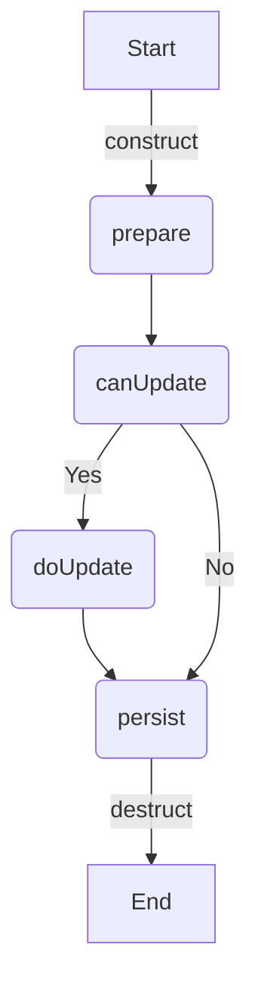

## metadata

```mermaid
graph TD
    A[Start] -->|construct| B(prepare)
    B --> C(canUpdate)
    C --> |Yes| D(doUpdate)
    D --> E(Text)
    C --> |No| E(persist)
    E --> |destruct| F[End]
```
